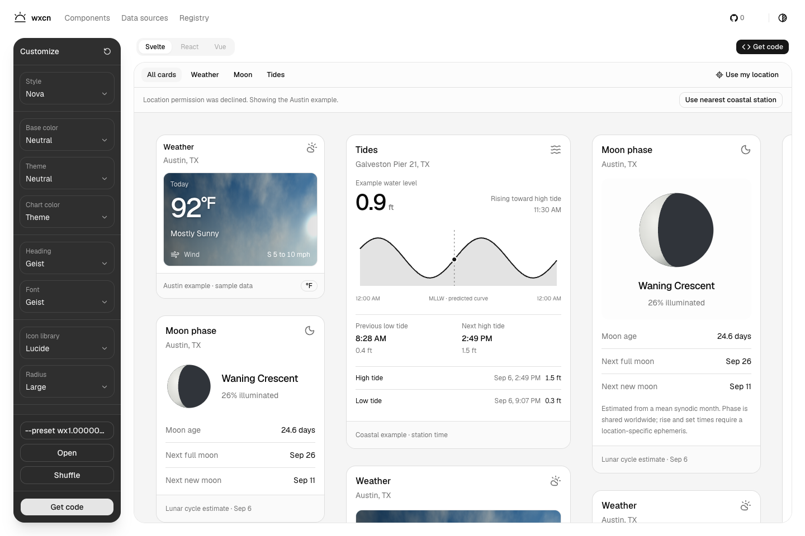

<div align="center">
  
  <h1>wxcn</h1>
  <p><strong>A little atmosphere for your interface.</strong></p>
  <p>Weather, moon, and tide components for Svelte.<br />Built on shadcn-svelte. Shaped by your theme. Yours to customize.</p>
  <p>
    <a href="#the-components">Components</a> ·
    <a href="#make-it-yours">Playground</a> ·
    <a href="#build-with-wxcn">Developer experience</a> ·
    <a href="LICENSE">MIT license</a>
  </p>
  <p><strong>Svelte 5</strong> &nbsp; / &nbsp; <strong>Tailwind CSS 4</strong> &nbsp; / &nbsp; <strong>LayerChart 2</strong></p>
</div>

<picture>
  <source media="(prefers-color-scheme: dark)" srcset="docs/images/playground-dark.png" />
  <source media="(prefers-color-scheme: light)" srcset="docs/images/playground.png" />
  
</picture>

## The components

A forecast at a glance, a view of the lunar cycle, or the next turn of the tide. Each card adapts to its container, with optional detail levels and units. Your project's colors, base components, radius, and selected icon library carry through.

<table>
  <tr>
    <th align="left" width="33%">Weather</th>
    <th align="left" width="33%">Moon</th>
    <th align="left" width="33%">Tides</th>
  </tr>
  <tr>
    <td valign="top"></td>
    <td valign="top"></td>
    <td valign="top"></td>
  </tr>
  <tr>
    <td valign="top">Temperature, wind, and forecast periods with optional cloud, rain, and snow backgrounds.</td>
    <td valign="top">A phase illustration, illumination, and estimated lunar-cycle dates.</td>
    <td valign="top">A LayerChart curve, current water level, and surrounding high/low events.</td>
  </tr>
</table>

<sub>Actual component screenshots from the local playground. Weather and tide images use clearly labeled example data; still images capture one frame of the animated backgrounds.</sub>

## Make it yours

Explore a wide canvas of mixed cards, or open a component collection to compare its variants. Resize a preview to see its typography adapt. Switch colors, fonts, icons, density, and units; use **Shuffle** to explore and **--preset / Open** to save and restore a configuration.

- **Native to your project.** Registry installation follows `components.json`, including aliases and Lucide, Tabler, Hugeicons, Phosphor, or Remix icons.
- **Light and dark, naturally.** Cards inherit your theme tokens. The registry adds no global theme or font.
- **Motion with restraint.** Atmospheric backgrounds sit behind readable information. Rain and snow respect reduced motion; offscreen animations pause.
- **Location-aware previews.** Browser location loads local US weather and coastal tides. Tides automatically use the nearest coastal station, including for inland visitors. Unavailable data stays clearly labeled.

Svelte is available today. **React and Vue are looking for contributors!**

## Build with wxcn

### Add the source to your project

Run the playground locally and open **Get code**, or visit its **Registry** page. Both use shadcn-svelte's **PMBlock** to provide the correct pnpm, npm, Yarn, or Bun command for your registry origin.

| Registry entry               | Includes                                             |
| ---------------------------- | ---------------------------------------------------- |
| `/r/weather-forecast.json`   | Weather card and atmospheric backgrounds             |
| `/r/moon-forecast.json`      | Moon card and phase illustration                     |
| `/r/tide-forecast.json`      | Tide card, LayerChart dependencies, and data helpers |
| `/r/forecast-dashboard.json` | All three cards and a composed dashboard             |

The CLI resolves the required `card` and `badge` primitives from your configuration. Icon selection happens **at installation time**; the playground's icon picker lets you preview those choices.

### Compose a forecast

After installing the registry components:

```svelte
<script lang="ts">
	import WeatherForecast from '$lib/components/wxcn/WeatherForecast.svelte';
	import MoonForecast from '$lib/components/wxcn/MoonForecast.svelte';
	import TideForecast from '$lib/components/wxcn/TideForecast.svelte';
</script>

<div class="grid items-start gap-4 md:grid-cols-3">
	<WeatherForecast unit="celsius" windUnit="km/h" animatedBackground />
	<MoonForecast type="simple" />
	<TideForecast unit="meter" density="compact" />
</div>
```

These defaults render example data. Supply your own `forecast`, tide `predictions`, `series`, and `reading` for a live interface; set `sourceLabel` to identify the data.

| Prop               | Options                         |
| ------------------ | ------------------------------- |
| `size`             | `sm`, `default`, `lg`           |
| `type`             | `simple`, `summary`, `detailed` |
| `density`          | `comfortable`, `compact`        |
| Weather `unit`     | `fahrenheit`, `celsius`         |
| Weather `windUnit` | `mph`, `km/h`, `m/s`, `knots`   |
| Tide `unit`        | `ft`, `meter`                   |

All unit props are optional. Defaults are Fahrenheit, mph, and feet. The dashboard exposes `weatherUnit`, `windUnit`, and `tideUnit` independently.

### Know your data

Weather uses NWS forecast periods, not instantaneous observations. Tides use NOAA MLLW heights and offset-aware timestamps; a fresh observation takes precedence, while readings older than 30 minutes fall back to a labeled prediction. Extrema alone never fabricate a current reading. Set `location.timeZone` for display times.

Moon phases use a mean lunar-cycle estimate. Full/new moon dates are approximate; moonrise and moonset are not calculated. The playground does not save location coordinates in browser storage.

### Work locally

Use the pnpm version pinned in [`package.json`](package.json) to install dependencies, then start the playground with `pnpm dev`.

| Command        | Purpose                                                |
| -------------- | ------------------------------------------------------ |
| `pnpm dev`     | Start the playground and local registry                |
| `pnpm check`   | Run Svelte and TypeScript checks                       |
| `pnpm test`    | Verify registry transforms, data handling, and presets |
| `pnpm lint`    | Check formatting                                       |
| `pnpm build`   | Regenerate the registry and build the site             |
| `pnpm package` | Build the Svelte library                               |

Component source lives in [`src/lib/components/wxcn`](src/lib/components/wxcn). [`scripts/build-registry.mjs`](scripts/build-registry.mjs) generates the installable registry from that source. For registry-only iteration, use the `registry:build` package script before testing an install.

<details>
<summary>About playground presets</summary>

Presets use the native `shadcn-svelte/preset` encoder and settings, so the same code produces the same theme in both projects. Units and weather conditions remain separate playground controls. Copy a code with **--preset** and restore it with **Open**.

</details>

## Contributing & credits

Contributions are welcome, especially React and Vue implementations that preserve the same theme and data contracts.

Built with [shadcn-svelte](https://github.com/huntabyte/shadcn-svelte) and [LayerChart](https://github.com/techniq/layerchart). The playground layout and controls are adapted from [shadcn-svelte PR #2755](https://github.com/huntabyte/shadcn-svelte/pull/2755). See [third-party notices](THIRD_PARTY_NOTICES.md) for attribution.

[MIT licensed](LICENSE).
