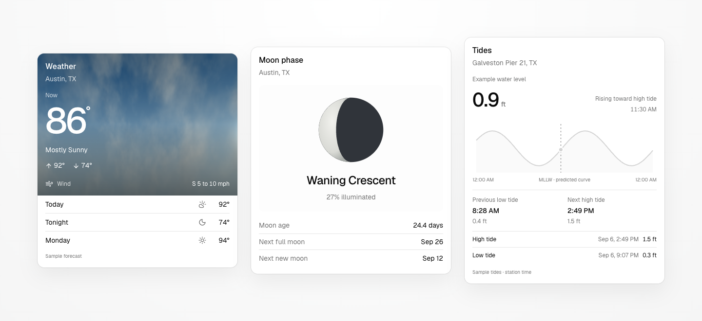
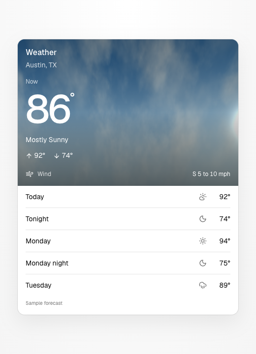
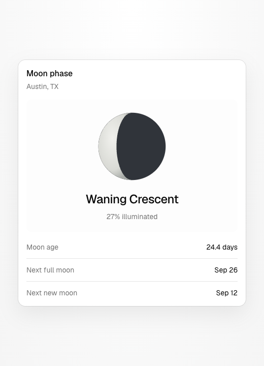
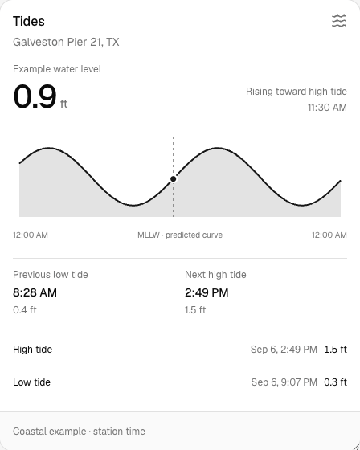

<div align="center">
  
  <h1>wxcn</h1>
  <p><strong>A little atmosphere for your interface.</strong></p>
  <p>Weather, moon, and tide components for Svelte, React, and Vue.<br />Built on native shadcn primitives. Shaped by your theme. Yours to customize.</p>
  <p>
    <a href="#the-components">Components</a> ·
    <a href="#make-it-yours">Playground</a> ·
    <a href="#build-with-wxcn">Developer experience</a> ·
    <a href="LICENSE">MIT license</a>
  </p>
  <p><strong>Svelte 5</strong> &nbsp; / &nbsp; <strong>React 19</strong> &nbsp; / &nbsp; <strong>Vue 3</strong> &nbsp; / &nbsp; <strong>Tailwind CSS 4</strong> &nbsp; / &nbsp; <strong>LayerChart 2</strong></p>
</div>

<picture>
  <source media="(prefers-color-scheme: dark)" srcset="docs/images/components-dark.png" />
  <source media="(prefers-color-scheme: light)" srcset="docs/images/components-light.png" />
  
</picture>

## The components

A forecast at a glance, a view of the lunar cycle, or the next turn of the tide. Each card adapts to its container, with optional detail levels and units. Your project's colors, base components, radius, and selected icon library carry through.

<table>
  <tr>
    <th align="left" width="33%">Weather</th>
    <th align="left" width="33%">Moon</th>
    <th align="left" width="33%">Tides</th>
  </tr>
  <tr>
    <td valign="top">
      <picture>
        <source media="(prefers-color-scheme: dark)" srcset="docs/images/weather-dark.png" />
        <source media="(prefers-color-scheme: light)" srcset="docs/images/weather.png" />
        
      </picture>
    </td>
    <td valign="top">
      <picture>
        <source media="(prefers-color-scheme: dark)" srcset="docs/images/moon-dark.png" />
        <source media="(prefers-color-scheme: light)" srcset="docs/images/moon.png" />
        
      </picture>
    </td>
    <td valign="top">
      <picture>
        <source media="(prefers-color-scheme: dark)" srcset="docs/images/tides-dark.png" />
        <source media="(prefers-color-scheme: light)" srcset="docs/images/tides.png" />
        
      </picture>
    </td>
  </tr>
  <tr>
    <td valign="top">Temperature, wind, and forecast periods with optional cloud, rain, and snow backgrounds.</td>
    <td valign="top">A phase illustration, illumination, and astronomically calculated lunar-cycle dates.</td>
    <td valign="top">An interactive prediction curve, current water level, and surrounding high/low events.</td>
  </tr>
</table>

<sub>Actual components, photographed in an isolated preview with example data. Still images capture one frame of the animated backgrounds.</sub>

## Make it yours

Explore a wide canvas of mixed cards, or open a component collection to compare its variants. Resize a preview to see its typography adapt. Switch colors, fonts, icons, density, and units; use **Shuffle** to explore, **Open** to load a shadcn-svelte preset, and **Get Code** to install a component.

- **Native to your project.** Registry installation follows `components.json`, including aliases and supported icon mappings. Svelte and React support Lucide, Tabler, Hugeicons, Phosphor, or Remix icons; Vue applies those mappings to navigation arrows while weather glyphs retain their canonical Lucide shapes.
- **Light and dark, naturally.** Cards inherit your theme tokens. The registry adds no global theme or font.
- **Motion with restraint.** Atmospheric backgrounds sit behind readable information. Rain and snow respect reduced motion; offscreen animations pause.
- **Location-aware previews.** Browser location loads local US weather and coastal tides. Tides automatically use the nearest coastal station, including for inland visitors. Unavailable data stays clearly labeled.

Svelte, [React](https://wxcn.dev/react), and [Vue](https://wxcn.dev/vue) are available today.

## Build with wxcn

### Add the source to your project

Run the playground locally and open **Get code**, or visit its **Registry** page. Both use shadcn-svelte's **PMBlock** to provide the correct pnpm, npm, Yarn, or Bun command for your registry origin.

| Registry entry               | Includes                                             |
| ---------------------------- | ---------------------------------------------------- |
| `/r/weather-forecast.json`   | Weather card and atmospheric backgrounds             |
| `/r/moon-forecast.json`      | Moon card and phase illustration                     |
| `/r/tide-forecast.json`      | Tide card, LayerChart dependencies, and data helpers |
| `/r/forecast-dashboard.json` | All three cards and a composed dashboard             |

React items use the `/r/react/<component>.json` endpoints and the same component names. The React registry installs native React components, Recharts, and the configured shadcn primitives. Its icon adapter supports Lucide, Tabler, Phosphor, Hugeicons, and Remixicon through the consumer's configured icon library.

Vue items use `/r/vue/<component>.json` with `shadcn-vue@latest` and install native Vue components using the same component names and shared data contracts. Weather glyphs retain their canonical Lucide shapes where shadcn-vue has no equivalent icon mapping; navigation arrows follow the configured icon library.

The CLI resolves the required `card` and `badge` primitives from your configuration. Supported icon mappings are applied **at installation time**; the playground's icon picker lets you preview those choices. Vue weather glyphs retain their canonical Lucide shapes.

### Compose a forecast

After installing the registry components:

```svelte
<script lang="ts">
	import WeatherForecast from '$lib/components/wxcn/WeatherForecast.svelte';
	import MoonForecast from '$lib/components/wxcn/MoonForecast.svelte';
	import TideForecast from '$lib/components/wxcn/TideForecast.svelte';
</script>

<div class="grid items-start gap-4 md:grid-cols-3">
	<WeatherForecast unit="celsius" windUnit="km/h" background="realistic" />
	<MoonForecast type="simple" />
	<TideForecast unit="meter" density="compact" />
</div>
```

For React, install the React endpoint and compose the native components in TSX:

```tsx
import WeatherForecast from '@/components/wxcn/weather-forecast';
import MoonForecast from '@/components/wxcn/moon-forecast';
import TideForecast from '@/components/wxcn/tide-forecast';

<div className="grid items-start gap-4 md:grid-cols-3">
	<WeatherForecast unit="celsius" windUnit="km/h" />
	<MoonForecast type="simple" />
	<TideForecast unit="meter" density="compact" />
</div>;
```

These defaults render example data. Supply your own `currentWeather` observation and `forecast`, tide `predictions`, `series`, and `reading` for a live interface; set `sourceLabel` to identify the data.

For weather, `showTemperatureTrend` adds “Going up to 92° today” or “Going down to 74° tonight.” Pass `currentWeather.highToday` (in its `temperatureUnit`) to stop the upward sentence once the day's high has been reached, even if it subsequently cools. `showHighLow` independently adds high/low arrows using your selected icon library. Both default to `false` and respect `unit`.

```svelte
<WeatherForecast
	{location}
	{currentWeather}
	{forecast}
	showTemperatureTrend
	showHighLow
	unit="celsius"
/>
```

`currentWeather` uses the exported `CurrentWeather` type, including `observedAt` and optional `highToday` / `lowToday`. Display time zones use explicit `timeZone`, then `location.timeZone`, then the browser time zone after hydration; SSR falls back to UTC when neither prop supplies a time zone. If a live observation is unavailable, pass `null`; the forecast remains visible without presenting a forecast high as the current temperature. The website's `/api/forecast` response supplies both `currentWeather` and `forecast`; bring your own data provider when installing the card.

| Prop               | Options                         |
| ------------------ | ------------------------------- |
| `size`             | `sm`, `default`, `lg`           |
| `type`             | `simple`, `summary`, `detailed` |
| `density`          | `comfortable`, `compact`        |
| Weather `unit`     | `fahrenheit`, `celsius`         |
| Weather `windUnit` | `mph`, `km/h`, `m/s`, `knots`   |
| Tide `unit`        | `ft`, `meter`                   |

All unit props are optional. Defaults are Fahrenheit, mph, and feet. The dashboard exposes `weatherUnit`, `windUnit`, and `tideUnit` independently.

### Know your data

Weather keeps the latest station observation separate from NWS forecast highs and lows. Tides use NOAA MLLW heights and offset-aware timestamps; a fresh observation takes precedence, while readings older than 30 minutes fall back to a labeled prediction. Extrema alone never fabricate a current reading. Display times follow the explicit `timeZone`, `location.timeZone`, browser-after-hydration precedence described above.

Sun and Moon positions, lunar illumination, and full/new moon dates are calculated locally with [Astronomy Engine](https://github.com/cosinekitty/astronomy). Weather skies follow the location and timestamp through sunrise, midday, sunset, and night. The fixed sky panorama uses calculated azimuth and altitude; discs are enlarged, and clouds are illustrative. The Sky time picker previews real rise/set and solar transit times. The playground does not save location coordinates in browser storage.

### Work locally

Use the pnpm version pinned in [`package.json`](package.json) to install dependencies, then start the playground with `pnpm dev`.

| Command                    | Purpose                                                    |
| -------------------------- | ---------------------------------------------------------- |
| `pnpm dev`                 | Start the playground and local registry                    |
| `pnpm check`               | Run Svelte, React, Vue, and TypeScript checks              |
| `pnpm test`                | Verify registry transforms, data handling, and presets     |
| `pnpm lint`                | Check formatting                                           |
| `pnpm build`               | Regenerate the registry and build the site                 |
| `pnpm registry:build`      | Generate installable Svelte, React, and Vue registry files |
| `pnpm dev:react`           | Start the standalone React/Vite preview harness            |
| `pnpm test:react`          | Run React SSR and semantic component tests                 |
| `pnpm build:react`         | Typecheck and build the React preview                      |
| `pnpm test:consumer:react` | Verify React registry installation in a clean consumer     |
| `pnpm dev:vue`             | Start the standalone Vue/Vite preview harness              |
| `pnpm test:vue`            | Run Vue semantic component tests                           |
| `pnpm build:vue`           | Typecheck and build the Vue preview                        |
| `pnpm test:consumer:vue`   | Verify Vue registry installation in a clean consumer       |

Component source lives in [`packages/svelte/src/components/wxcn`](packages/svelte/src/components/wxcn), [`packages/react/src/components/wxcn`](packages/react/src/components/wxcn), and [`packages/vue/src/components/wxcn`](packages/vue/src/components/wxcn), with shared data and calculations in [`packages/core`](packages/core). [`tooling/registry/build.mjs`](tooling/registry/build.mjs) generates all three installable registries from that source. For registry-only iteration, use the `registry:build` package script before testing an install.

<details>
<summary>About playground presets</summary>

The Svelte playground uses the native `shadcn-svelte/preset` encoder and can open codes from shadcn-svelte. React uses its native shadcn preset codec. Vue uses the wxcn designer because matching shadcn-vue preset-code compatibility has not been verified. Units and weather conditions remain separate playground controls.

</details>

## Contributing & credits

Contributions are welcome. Preserve the shared theme and data contracts across all three frameworks.

Built with [shadcn-svelte](https://github.com/huntabyte/shadcn-svelte) and [LayerChart](https://github.com/techniq/layerchart). The playground layout and controls are adapted from [shadcn-svelte PR #2755](https://github.com/huntabyte/shadcn-svelte/pull/2755). See [third-party notices](THIRD_PARTY_NOTICES.md) for attribution.

[MIT licensed](LICENSE).

## Contributing across frameworks

The pnpm workspace separates the Astro website (`apps/web`), native framework components (`packages/svelte`, `packages/react`, and `packages/vue`), and shared TypeScript logic (`packages/core`).

Svelte registry items are available at `/r/svelte/<component>.json`. Existing `/r/<component>.json` URLs remain compatible. See [CONTRIBUTING.md](CONTRIBUTING.md) for setup, framework adapters, parity requirements, and deployment configuration.

### Agent documentation

Every public page has a Markdown version: use `/index.md`, `/docs/components.md`, `/docs/endpoints.md`, or `/shader-preview.md`, or request the normal URL with `Accept: text/markdown`. `/llms.txt` lists these pages. Component Markdown includes usage, installation steps, and the same source files as the manual code viewer.

The [wxcn skill](skills/wxcn/SKILL.md) provides registry installation, data-prop, theming, and contribution guidance. Install it with `npx skills add maxffarrell/wxcn-svelte --skill wxcn`.

Production site: [wxcn.dev](https://wxcn.dev). The Astro site serves native Svelte, React, and Vue previews and documentation. Production deployment is handled by the linked Cloudflare Workers Builds project.
